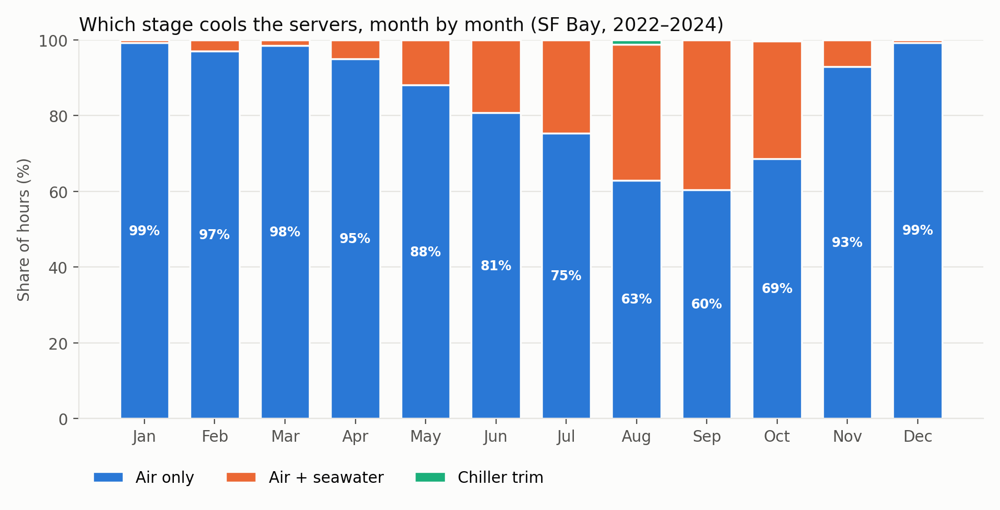
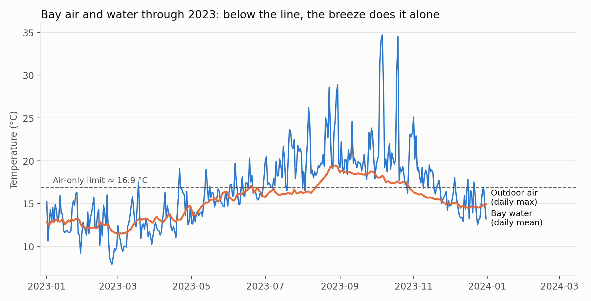
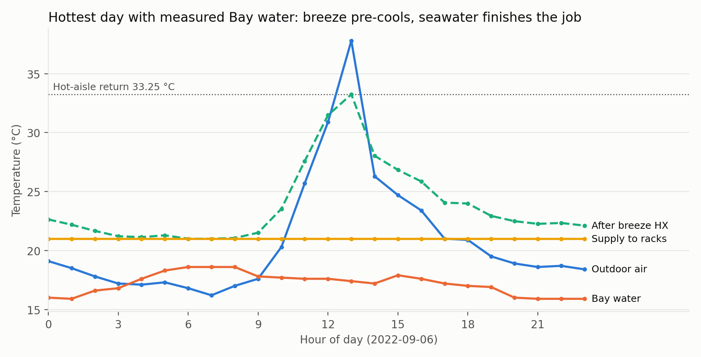
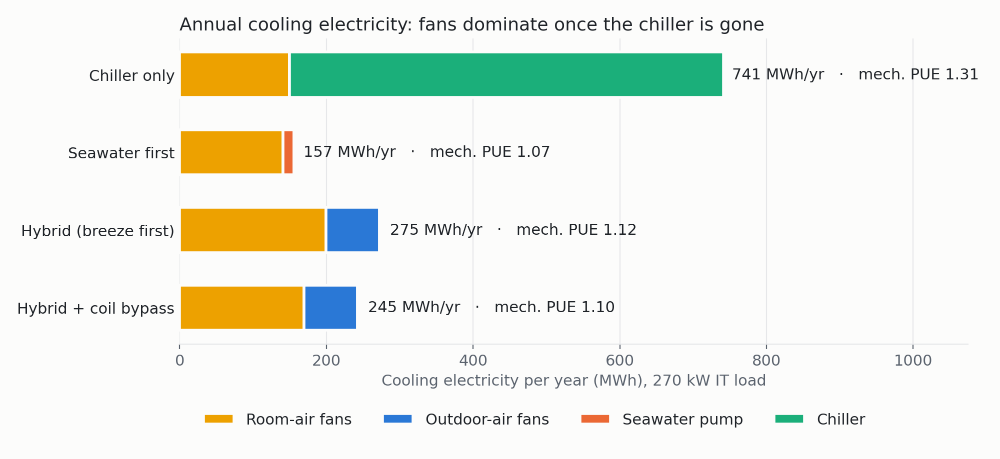
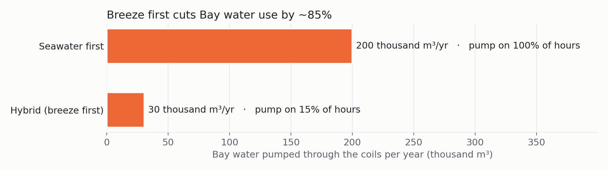

# Bay Breeze Cooling: a hybrid air / seawater cooled data center on the San Francisco Bay

Can the Bay Area's cool marine-layer breeze do most of the work of cooling a data center, with pumped
Bay water held in reserve? This repo is an early-stage, independent feasibility study. It follows the
cooling chain from the outside air all the way to the server racks.



## The idea

A small data center sits on a pile-supported platform above the Bay. Cooling happens in three stages, in order:

1. **Breeze (primary):** an indirect air-to-air heat exchanger. Outside air cools the room air across a
   heat exchanger and never enters the server room. That matters because Bay air averages ~79% relative humidity.
2. **Bay water (secondary):** an air-to-seawater coil, pumped **only** when the breeze isn't enough.
3. **Chiller (fallback):** trims whatever is left on the rare hottest hours.

Existing water-cooled Bay-area designs pump water continuously. This design treats seawater as a
corrosive, environmentally sensitive resource to use sparingly.

## Key results (3 years of hourly data, 2022–2024)

Reference room: 18 racks × 15 kW = **270 kW**, two cooling paths, 21 °C supply air, 33.25 °C hot-aisle return (from CFD).

| Result | Value |
|---|---|
| Hours the breeze alone holds 21 °C supply | **84.8%** |
| Hours Bay water is also needed | 15.1% (pump runtime) |
| Hours the chiller is needed | 0.14% (peak ~17 kW thermal) |
| Outside air limit for breeze-only cooling | ≈ 16.9 °C |
| Direct outside air into the room (for comparison) | only 3.9% of hours meet ASHRAE's recommended envelope, because of humidity |

Summer and early fall are the hard season, not the easy one: in September, the breeze covers 60% of hours
and Bay water carries the rest.

**Sensitivity** (share of hours with breeze only, 21 °C supply):

| Stage-1 effectiveness | Outside/room airflow 1.0 | 1.5 |
|---|---|---|
| 0.65 | 63% | 83% |
| 0.75 | 85% | 93% |
| 0.85 | 93% | 96% |

Allowing a 24 °C supply (still inside ASHRAE's recommended 18–27 °C band) raises breeze-only hours to 93–99%.
Full table: [`results/sensitivity.csv`](results/sensitivity.csv).




## Energy: does it actually save power?

Adding every fan and pump (typical pressure drops and efficiencies, see `energy_model.py`) gives annual
cooling electricity for the 270 kW room:

| Option | Cooling electricity | Mech. PUE | Bay water pumped |
|---|---|---|---|
| Chiller only | 741 MWh/yr | 1.31 | none |
| Seawater first (pump every hour) | 157 MWh/yr | 1.07 | 200,000 m³/yr |
| **Hybrid, breeze first** | **275 MWh/yr** | **1.12** | **30,500 m³/yr** |
| Hybrid + seawater-coil bypass | 245 MWh/yr | 1.10 | 30,500 m³/yr |

Honest result: the hybrid uses about two-thirds less energy than a chiller plant, but **pumping Bay water every
hour uses even less**, because fans cost more than pumps. The hybrid's advantage is Bay impact: ~85% less seawater
pumped and ~40× less heat returned to the Bay, for about $0.09 of electricity per m³ of seawater avoided.
A 24 °C supply cuts pump runtime to 2.9% of hours (PUE 1.10).




## Room-level CFD (Ansys Icepak)

The 21 °C supply and 33.25 °C return used above come from a room CFD model: 18 racks in a
hot/cold-aisle layout, ~96,000-cell mesh, turbulent flow with gravity. The cold aisle held 21 °C and hot-aisle air
peaked at 33.25 °C (hand calculation: 32.1 °C). Hot air leaks around the row ends, which is the next thing to fix.
Full report: [`docs/DC_CFD_Test1_Report.pdf`](docs/DC_CFD_Test1_Report.pdf).

## How it works (method)

- **Data:** hourly air temperature, humidity and dew point for a SF Bay coastal point
  ([Open-Meteo](https://open-meteo.com/) historical archive), and hourly water temperature from
  [NOAA CO-OPS station 9414290](https://tidesandcurrents.noaa.gov/stationhome.html?id=9414290) (San Francisco).
  Water data is missing after Feb 2024; those hours are filled with month-by-hour averages of the measured data.
- **Stage 1:** cross-flow, both-fluids-unmixed ε-NTU relation. UA is set by a design effectiveness of 0.75
  at equal outside/room airflow; effectiveness then shifts with the airflow ratio.
- **Stage 2:** counterflow air-to-seawater coil, design effectiveness 0.80, 3.25 kg/s seawater per path.
- **Control:** each hour, use the breeze first (modulated so it never overcools), add Bay water only if the
  supply is still above setpoint, and send any remainder to the chiller (COP 5).

## Run it

```bash
pip install -r requirements.txt
python fetch_data.py      # optional: re-download the data (already included in data/)
python climate_model.py   # simple screen: how often is air/water cold enough?
python hx_model.py        # the two-stage heat exchanger chain + sensitivity
python plots.py           # charts in results/
python energy_model.py    # fan + pump + chiller power, PUE, baselines, sensitivity
python plots_energy.py    # energy charts
```

## Limitations

- Single weather grid point and single tide station, not an on-site survey; 3 years of data, not a 30-year normal.
- Heat exchanger effectiveness values are design assumptions, not vendor data. The sensitivity table shows how much they matter.
- Fan power and pressure drop through filters, ducts and coils aren't modeled yet.
- The CFD model sets the rack airflow and heat as inputs; it tests how the room air behaves, not rack internals.
- Not peer reviewed. Feedback from data center thermal, marine/corrosion and HVAC engineers is very welcome.

## Next steps

- CFD: end-of-row panels, and a summer stress case with warmer supply air
- Fan power from filter, duct and coil pressure drops
- Hour-by-hour control simulation with pump hysteresis and a seawater runtime budget

## Credits

Research idea, design decisions and modeling direction: **Vishnu Sai Sharan Ankathi**
([vankathi@usc.edu](mailto:vankathi@usc.edu)). AI tools were used to help write code, run calculations and draft documentation.
Data: Open-Meteo (CC BY 4.0) and NOAA CO-OPS (public domain).
